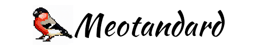
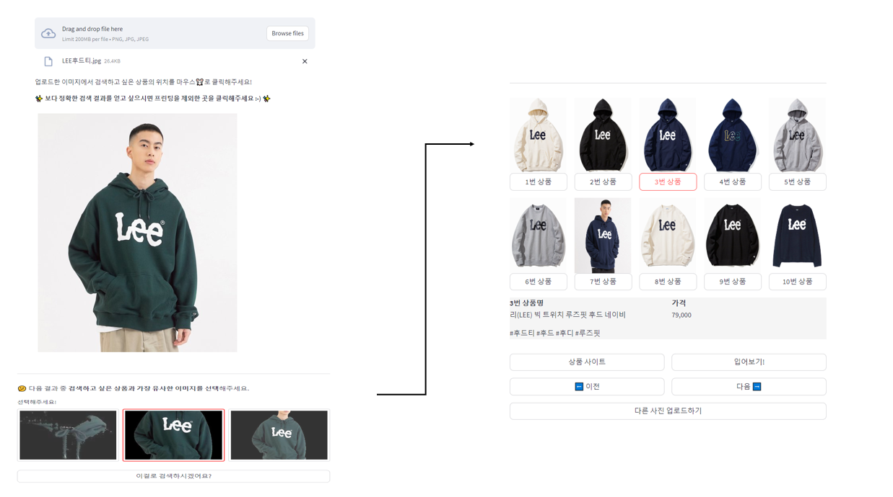
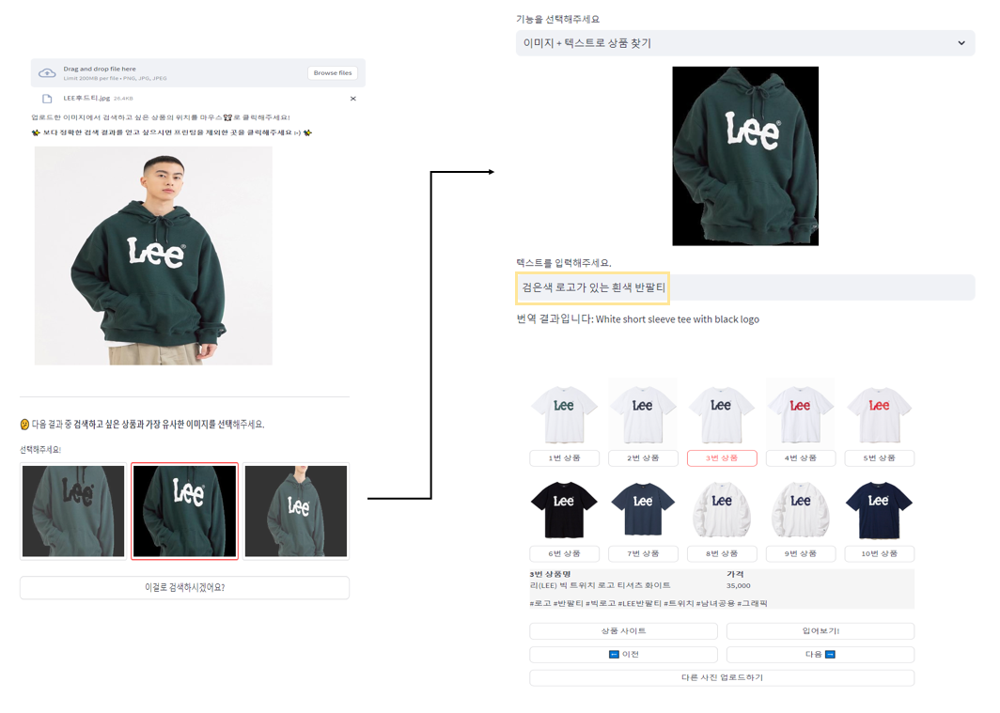
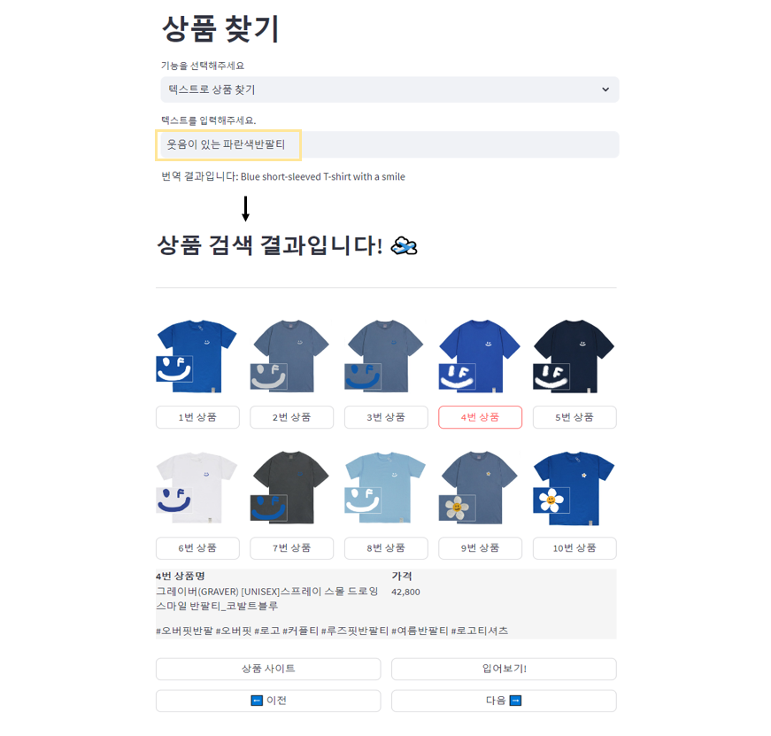
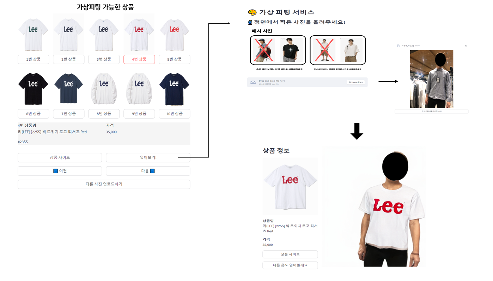
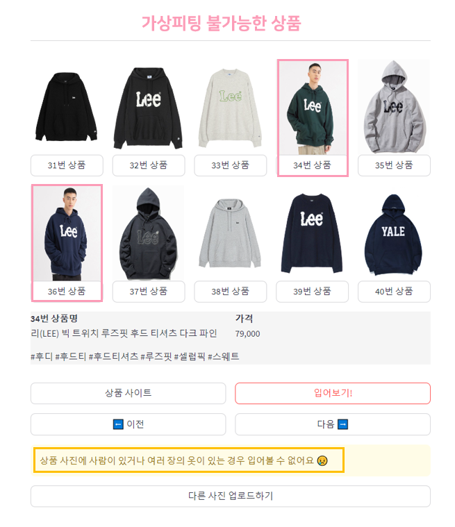

# :shirt:**Meotandard**

> 소셜 미디어 플랫폼에서 발견한 옷에 대한 정보 부재와 온라인에서의 스타일 판단 어려움을 해결하기 위한 서비스
>   > 개발 기간 : 2023.07.01~ 2023.07.27

:loudspeaker: 아래 이미지를 클릭해서 `demo 영상`을 볼 수 있습니다. 

[](https://youtu.be/b6DO6gwo4Q0)

<br><br>

## :zap: 팀 멋쟁이
- - -
<table>
    <tr height="160px">
        <td align="center" width="150px">
            <a href="https://github.com/Happy-ryan"></a>
            <br/>
            <a href="https://github.com/Happy-ryan"><strong>김성한</strong></a>
            <br />
        </td>
        <td align="center" width="150px">
            <a href="https://github.com/nstalways"></a>
            <br />
            <a href="https://github.com/nstalways"><strong>박수영</strong></a>
            <br />
        </td>
        <td align="center" width="150px">
            <a href="https://github.com/DaHyeonnn"></a>
            <br/>
            <a href="https://github.com/DaHyeonnn"><strong>이다현</strong></a>
            <br />
        </td>
        <td align="center" width="150px">
            <a href="https://github.com/Chaewon829"></a>
            <br/>
            <a href="https://github.com/Chaewon829"><strong>이채원</strong></a>
            <br />
        </td>
        <td align="center" width="150px">
            <a href="https://github.com/Eumgill98"></a>
            <br />
            <a href="https://github.com/Eumgill98"><strong>정호찬</strong></a>
            <br />
        </td>
    </tr>
</table>

<br><br>


##  :womans_clothes: 기능 소개 
- - -

**:white_check_mark: 유사 의류 검색** : 소셜 미디어에서 마음에 드는 옷을 발견했지만 정보를 알 수 없을때! 이미지 검색을 통해 유사한 의류 정보를 찾을 수 있습니다

**:white_check_mark: 가상 피팅 기능** : 의류 정보를 찾았으면 가상 피팅 기능을 통해 나에게 어울릴지를 판단해 볼 수 있습니다. 

### **각 기능 소개 요약**
---
**1. 이미지 검색✔**
<!-- -->
</img>
- 업로드한 상품과 유사한 상품 50개를 확인할 수 있습니다.
- 각 상품에 대한 정보 확인 및 구매 가능한 사이트로 이동이 가능합니다.<br>
      -> 구매에 대한 접근성 향상
---
**2. 이미지 텍스트 검색✔**
<!-- -->
</img>
-  예시. Image : `LEE 후드티 이미지` + Text : `검은색 로고가 있는 흰색 반팔티` => `LEE 브랜드의 흰색 반팔티`
- 이미지와 텍스트를 함께 사용하여 원하는 옷을 구체적으로 정확하게 찾아낼 수 있습니다.
---
**3. 텍스트 검색✔**<br>
</img>
-  예시. Text : `웃음이 있는 파란색 반팔티`
- 상품의 이미지가 없어도 Text로 원하는 상품을 찾을 수 있습니다.
---
**4. 가상피팅✔**<br>
</img>
- 본인의 전신사진에 가상피팅하는 기능입니다.
- 피팅 결과와 상품 정보 및 사이트를 제공하여 구매율을 향상시킵니다.
---
**4-1. 가상피팅 불가상품✔**<br>
</img>
- `상품 사진에 사람 혹은 여러 장의 옷이 포함`되어 있는 경우, 가상피팅의 품질이 떨어지기 때문에<br> 최소한의 피팅의 성능을 확보하기 위해, 특정 사진들은 피팅이 불가능하도록 제어합니다.

  
---
> 자세한 기능과 Tech 설명은 ['링크'](https://bottlenose-oak-2e3.notion.site/e2ca44b0357f4c39a61490592450576a?pvs=4)에서 확인하실 수 있습니다.

<br><br>

## :file_folder: 폴더 구조 
- - -
```
📦 멋탠다드
├── 📂frontend_main 
│   ├── 📜Home.py
│   ├── 📜frontend_requirements.txt
│   ├── 📜meotandard_apis.py
│   ├── 📂datas
│   ├── 📂pages : 각 기능별 페이지
│   └── 📂utils
│
├──📂 seg_api 
│   ├── 📂frontend
│   │    ├── 📜 __main__.py
│   │    ├── 📜main.py
│   │    └── 📜predictor.py
│   ├── 📜pyproject.toml
│   └── 📂weights
│
├── 📂retrieval_api
│    ├── 📂admin    
│    └── 📂customer
│
├──📂viton_api
│     ├── 📂backend  
│     └── 📂frontend
│
└──📂data_crawler
    ├── 📂good-or-not
    ├── 📂musinsa-crawling
    └── 📜README.md
```
> 자세한 architecture와 실행 방법은 각 api의 개별 Readme를 참고해 주시기 바랍니다. 
